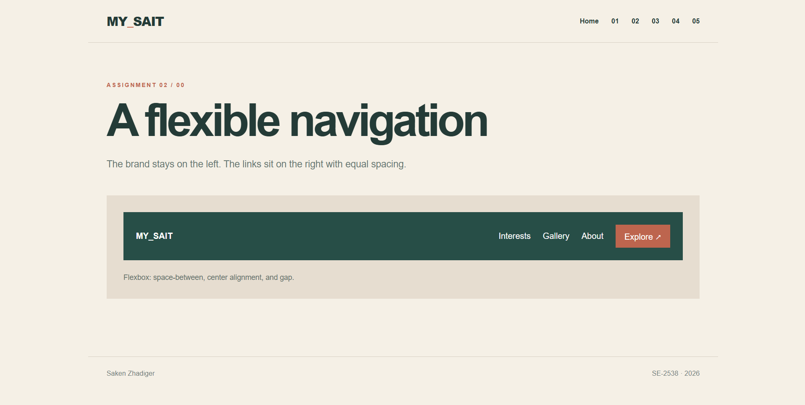
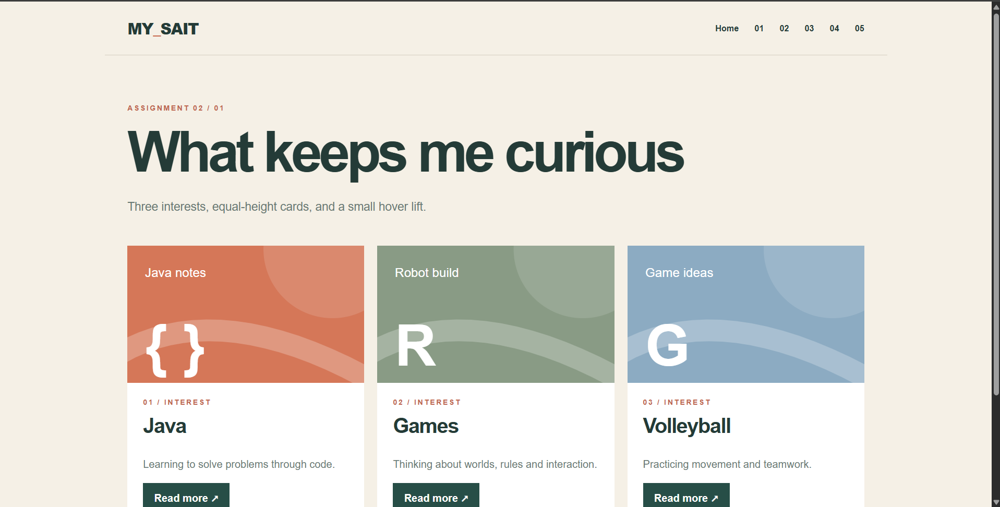
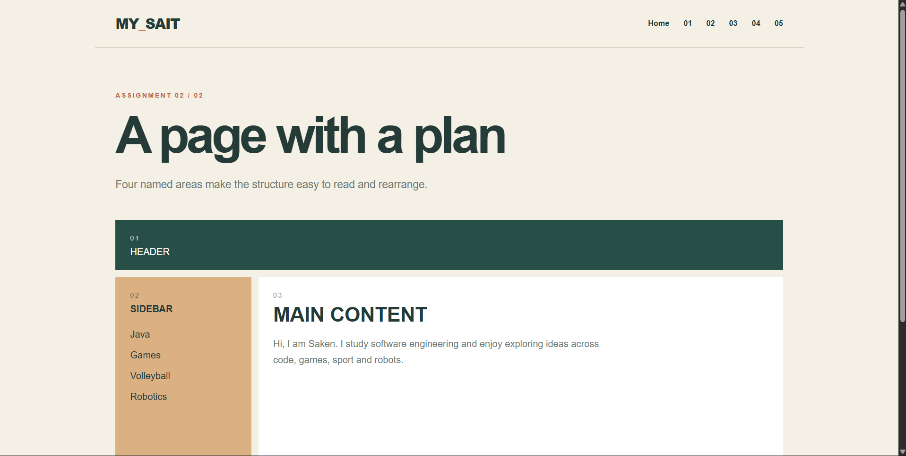
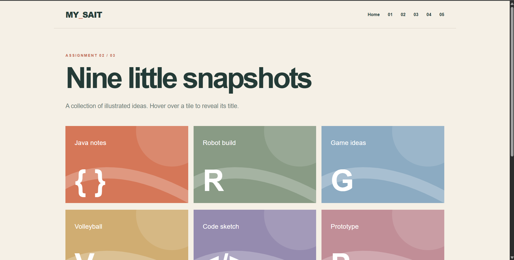
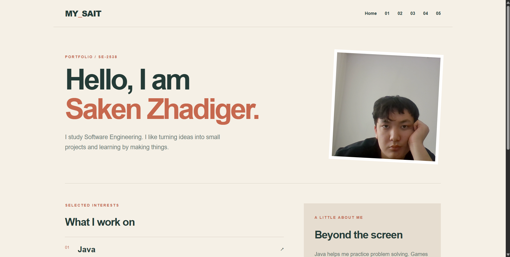

# My_Sait — Assignment 2: Advanced CSS

**Student:** Saken Zhadiger  
**Group:** SE-2538

Objective

Create responsive page layouts using Flexbox and CSS Grid. The website presents my interests in Java, games, volleyball and robotics.

How to open the project

Download or clone the repository and open index.html in a browser. The home page links to all five tasks. All styles and images are stored in this project, so no additional packages are required.

## Task 0 — Navigation Bar

The example bar uses Flexbox. Space between separates the logo and links; align-items centers them vertically, while gap spaces out the links.

## Task 1 — Card Row

Three cards form a Flexbox row. Each card has an image, heading, text and link styled as an action. Flexbox inside the cards keeps the actions aligned. Hover lifts a card.

## Task 2 — Page Layout with Grid Areas

Grid template areas position the header, sidebar, main content and footer. On narrow screens, the areas stack vertically.

## Task 3 — Image Gallery

Nine local illustrations sit in a three-column Grid with equal gaps. Hover enlarges an image and shows its caption.

## Task 4 — Portfolio Page

The portfolio combines a Flexbox navigation and Flexbox project rows with a two-column Grid for the projects and sidebar. My portrait appears above the projects.

Work process
1. I created separate HTML pages for the five tasks and connected them from index.html.
2. I wrote the shared rules in style.css and used Flexbox and Grid for the required layouts.
3. I added local illustrations, my portrait, hover effects and media queries for smaller screens.
4. I organized the project into pages, images and screenshots.

Conclusion

This assignment helped me understand when to use Flexbox and when to use CSS Grid. Flexbox worked well for navigation, cards and content inside the project rows. Grid made it easier to build the page layout and the image gallery. I also practiced keeping spacing consistent, adding hover effects and adjusting layouts for smaller screens. The most useful part was combining both layout methods on the portfolio page.